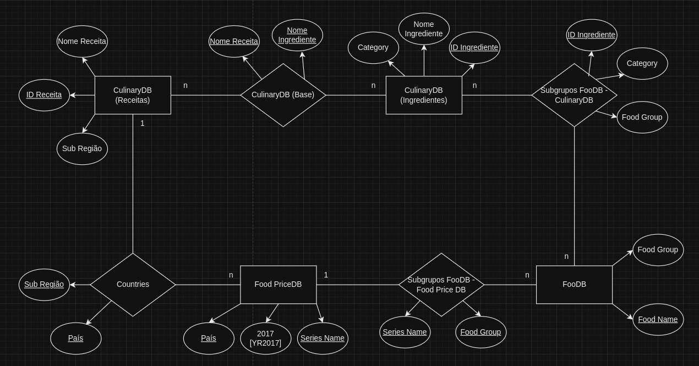
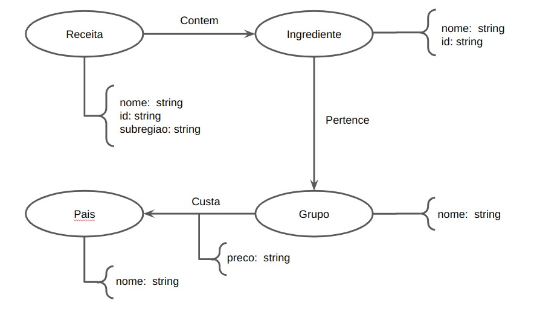

# Modelo de Apresentação dos Projetos

## Motivação e Contexto

> Objetiva-se, por meio deste projeto, realizar uma análise econômica e social no tocante à dietas e alimentos consumidos ao redor do globo, levando em conta os conceitos e ferramentas relacionados à Banco de Dados. Para isso, utilizamos, principalmente, as bases World Food Prices, CulinaryDB e FooDB, que nos garantem acesso aos custos de ingredientes e receitas da maioria das regiões ao redor do planeta. Desse modo, conseguimos avaliar nutricional e economicamente as múltiplas dietas adotadas mundialmente e associá-las ao seu contexto regional, econômico e social.

## Slides

## Apresentação Prévia
> [link apresentação prévia](https://docs.google.com/presentation/d/1N923BpFqJgYXyllvehe5JJaJiW3ZCo-WHdwJqBCGiD0/edit#slide=id.g27f0b59aa52_0_83)

## Apresentação Final
> [link apresentação final](https://docs.google.com/presentation/d/1Taj48a8GKqPzU9CUbP9y4i7bNl9tDlVoA_tJ8n6gR8g/edit#slide=id.g2a1efa1ef36_0_0)

## Modelo Conceitual

## Modelos Lógicos

> Coloque aqui o modelo lógico relacional dos bancos de dados relacionados aos modelos conceitual. Sugere-se o fortmato a seguir.

> Exemplo de modelo lógico relacional
~~~
PESSOA(_Código_, Nome, Telefone)
ARMÁRIO(_Código_, Tamanho, Ocupante)
  Ocupante chave estrangeira -> PESSOA(Código)
~~~

## Dataset Publicado
> Se ao tratar e integrar os dados originais foram produzidas novas bases relacionais ou de grafos, elencar essas bases.

título do arquivo/base | link | breve descrição
----- | ----- | -----
`CountriesTable` | `https://raw.githubusercontent.com/lipecorradini/mc536-PLAY/main/data/interim/CountriesTable.csv` | `Tabela que relaciona todos os países existentes na base de dados "Food Prices DB" com sua respectiva subregião geocultural estabelecida pela CulinaryDB.`
`<título do arquivo/base>` | `<link para arquivo/base>` | `<breve descrição do arquivo/base>`

> Os arquivos finais do dataset publicado devem ser colocados na pasta `data`, em subpasta `processed`. Outros arquivos serão colocados em subpastas conforme seu papel (externo, interim, raw). A diferença entre externo e raw é que o raw é em formato não adaptado para uso. A pasta `raw` é opcional, pois pode ser substituída pelo link para a base original da seção anterior.
> Coloque arquivos que não estejam disponíveis online e sejam acessados pelo notebook. Relacionais (usualmente CSV), XML, JSON e CSV ou triplas para grafos.
> Este é o conjunto mínimo de informações que deve constar na disponibilização do Dataset, mas a equipe pode enriquecer esta seção.

## Bases de Dados
> Elencar as bases de dados fonte utilizadas no projeto.

título da base | link | breve descrição
----- | ----- | -----
`Culinary DB` | `https://cosylab.iiitd.edu.in/culinarydb/#databasedescription` | `Base de dados que contêm informações sobre ingredientes utilizados e receitas tradicionais de 22 regiões geoculturais do globo.`
`FooDB` | `https://foodb.ca/` | `Base de dados sobre informações químicas e biológicas, como macro e micronutrientes, de centenas de alimentos utilizados no planeta inteiro.`
`Food Prices for Nutrition (DataBank)` | `https://databank.worldbank.org/source/food-prices-for-nutrition/Type/TABLE/preview/on#` | `Base de dados que contém informações sobre o preço de grupos de alimentos como frutas, legumes, nozes, óleos, entre outros; de todos os países do mundo.`

## Detalhamento do Projeto
> Apresente aqui detalhes do processo de construção do dataset e análise. Nesta seção ou na seção de Perguntas podem aparecer destaques de código como indicado a seguir. Note que foi usada uma técnica de highlight de código, que envolve colocar o nome da linguagem na abertura de um trecho com `~~~`, tal como `~~~python`.
> Os destaques de código devem ser trechos pequenos de poucas linhas, que estejam diretamente ligados a alguma explicação. Não utilize trechos extensos de código. Se algum código funcionar online (tal como um Jupyter Notebook), aqui pode haver links. No caso do Jupyter, preferencialmente para o Binder abrindo diretamente o notebook em questão.

~~~python
df = pd.read_excel("/content/drive/My Drive/Colab Notebooks/dataset.xlsx");
sns.set(color_codes=True);
sns.distplot(df.Hemoglobin);
plt.show();
~~~

> Coloque um link para o arquivo do notebook, programas ou workflows que executam as operações que você apresentar.

> Aqui devem ser apresentadas as operações de construção do dataset:
* extração de dados de fontes não estruturadas como, por exemplo, páginas Web
* agregação de dados fragmentados obtidos a partir de API
* integração de dados de múltiplas fontes
* tratamento de dados
* transformação de dados para facilitar análise e pesquisa

> Se for notebook, ele estará dentro da pasta `notebook`. Se por alguma razão o código não for executável no Jupyter, coloque na pasta `src` (por exemplo, arquivos do Orange ou Cytoscape). Se as operações envolverem queries executadas atraves de uma interface de um SGBD não executável no Jupyter, como o Cypher, apresente na forma de markdown.

## Evolução do Projeto
> Relatório de evolução, descrevendo as evoluções na modelagem do projeto, dificuldades enfrentadas, mudanças de rumo, melhorias e lições aprendidas. Referências aos diagramas, modelos e recortes de mudanças são bem-vindos.
> Podem ser apresentados destaques na evolução dos modelos conceitual e lógico. O modelo inicial e intermediários (quando relevantes) e explicação de refinamentos, mudanças ou evolução do projeto que fundamentaram as decisões.
> Relatar o processo para se alcançar os resultados é tão importante quanto os resultados.

## Perguntas de Pesquisa/Análise Combinadas e Respectivas Análises

> Apresente os resultados da forma mais rica possível, com gráficos e tabelas. Mesmo que o seu código rode online em um notebook, copie para esta parte a figura estática. A referência a código e links para execução online pode ser feita aqui ou na seção de detalhamento do projeto (o que for mais pertinente).

> Liste aqui as perguntas de pesquisa/análise e respectivas análises. Nem todas as perguntas precisam de queries que as implementam. É possível haver perguntas em que a solução é apenas descrita para demonstrar o potencial da base. Abaixo são ilustradas três perguntas, mas pode ser um número maior a critério da equipe.
>
### Perguntas/Análise com Resposta Implementada

> As respostas às perguntas podem devem ser ilustradas da forma mais rica possível com tabelas resultantes, grafos ou gráficos que apresentam os resultados. Os resultados podem ser analisados e comentados. Veja um exemplo de figura ilustrando uma comunidade detectada no Cytoscape:

> 

#### Pergunta/Análise 1
> * Pergunta 1
>   
>   * Explicação sucinta da análise que será feita e conjunto de queries que
>     responde à pergunta.

#### Pergunta/Análise 2
> * Pergunta 2
>   
>   * Explicação sucinta da análise que será feita e conjunto de queries que
>     responde à pergunta.

#### Pergunta/Análise 3
> * Pergunta 3
>   
>   * Explicação sucinta da análise que será feita e conjunto de queries que
>     responde à pergunta.

### Perguntas/Análise Propostas mas Não Implementadas

#### Pergunta/Análise 1
> * Pergunta 1
>   
>   * Explicação em linhas gerais de como a base pode ser usada para responder esta pergunta e a sua relevância.

#### Pergunta/Análise 2
> * Pergunta 2
>   
>   * Explicação em linhas gerais de como a base pode ser usada para responder esta pergunta e a sua relevância.

#### Pergunta/Análise 3
> * Pergunta 3
>   
>   * Explicação em linhas gerais de como a base pode ser usada para responder esta pergunta e a sua relevância.

> Coloque um link para o arquivo do notebook que executa o conjunto de queries. Ele estará dentro da pasta `notebook`. Se por alguma razão o código não for executável no Jupyter, coloque na pasta `src`. Se as queries forem executadas atraves de uma interface de um SGBD não executável no Jupyter, como o Cypher, apresente na forma de markdown.

# Projeto `Regional recipes and their costs`

# Equipe `PLAY`

- `André Santos Rocha` - `235887`
- `Gustavo Henrique Luiz Merlo` - `171401`
- `José Felipe Theodoro` - `219081`
- `Luiz Felipe Corradini Rego Costa` - `230613`
- `Mariano Cho` - `230797`
- `Pedro da Rosa Pinheiro` - `231081`

## Bases de Dados
| título da base     | link                           | breve descrição             |
| ------------------ | ------------------------------ | --------------------------- |
`Food Prices DB` | `https://databank.worldbank.org/source/food-prices-for-nutrition/Type/TABLE/preview/on#` | `Base de dados que contém informações sobre o preço de grupos de alimentos como frutas, legumes, nozes, óleos, entre outros; de todos os países do mundo.`
`Culinary DB` | `https://cosylab.iiitd.edu.in/culinarydb/#databasedescription` | `Base de dados que contêm informações sobre ingredientes utilizados e receitas tradicionais de 22 regiões geoculturais do globo.`
`FooDB` | `https://foodb.ca/` | `Base de dados sobre informações químicas e biológicas, como macro e micronutrientes, de centenas de alimentos utilizados no planeta inteiro.`

## Resumo do Projeto

> Objetiva-se, por meio deste projeto, realizar uma análise econômica e social no tocante à dietas e alimentos consumidos ao redor do globo, levando em conta os conceitos e ferramentas relacionados à Banco de Dados.
Para isso, utilizamos, principalmente, as bases World Food Prices, CulinaryDB e FooDB, que nos garantem acesso aos custos de ingredientes e receitas da maioria das regiões ao redor do planeta. Desse modo, conseguimos avaliar nutricional e economicamente as múltiplas dietas adotadas mundialmente e associá-las ao seu contexto regional, econômico e social.
