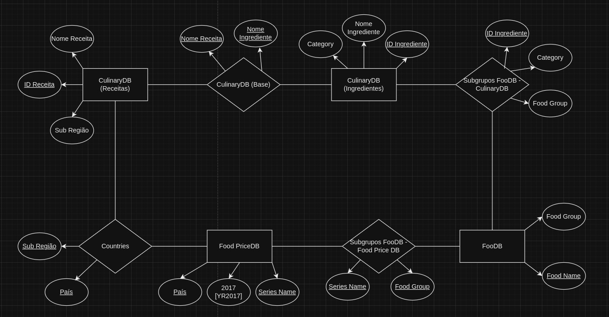
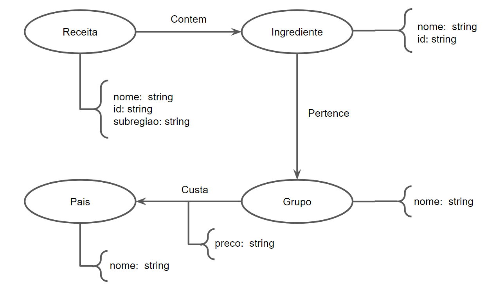

# Modelo de Apresentação dos Projetos

## Motivação e Contexto

> Objetiva-se, por meio deste projeto, realizar uma análise econômica e social no tocante à dietas e alimentos consumidos ao redor do globo, levando em conta os conceitos e ferramentas relacionados à Banco de Dados. Para isso, utilizamos, principalmente, as bases World Food Prices, CulinaryDB e FooDB, que nos garantem acesso aos custos de ingredientes e receitas da maioria das regiões ao redor do planeta. Desse modo, conseguimos avaliar nutricional e economicamente as múltiplas dietas adotadas mundialmente e associá-las ao seu contexto regional, econômico e social.

## Slides

## Apresentação Prévia
> [link apresentação prévia](https://docs.google.com/presentation/d/1N923BpFqJgYXyllvehe5JJaJiW3ZCo-WHdwJqBCGiD0/edit#slide=id.g27f0b59aa52_0_83)

## Apresentação Final
> [link apresentação final](https://docs.google.com/presentation/d/1Taj48a8GKqPzU9CUbP9y4i7bNl9tDlVoA_tJ8n6gR8g/edit#slide=id.g2a1efa1ef36_0_0)

## Modelo Conceitual


## Modelos Lógicos
~~~
IngredientesCDB(NomeIngrediente, _IDIngrediente_, Category)

ReceitasCDB(NomeReceita, _IDReceita_, SubRegiao)

BaseCDB(_NomeIngrediente_, _NomeReceita_)
  NomeIngrediente chave estrangeira -> IngredientesCDB(NomeIngrediente)
  NomeReceita chave estrangeira -> ReceitasCDB(NomeReceita)

FoodPriceDB(_Pais_, 2017[YR2017], _SeriesName_)

Countries(_SubRegiao_, _Pais_)
  SubRegiao chave estrangeira -> ReceitasCDB(SubRegiao)
  Pais chave estrangeira -> FoodPriceDB(Pais)

FooDB(FoodGroup, _FoodName_)

SubgruposFoodDBPrice(_SeriesName_, _FoodGroup_)
  SeriesName chave estrangeira -> FoodPriceDB(SeriesName)
  FoodGroup chave estrangeira -> FooDB(FoodGroup)

SubgruposFooDBCDB(_IDIngrediente_, Category, FoodGroup)
  IDIngrediente chave estrangeira -> IngredientesCDB(IDIngrediente)
  Category chave estrangeira -> IngredientesCDB(Category)
  FoodGroup chave estrangeira -> FooDB(FoodGroup)
~~~



## Dataset Publicado
título do arquivo/base | link | breve descrição
----- | ----- | -----
`CountriesTable` | `https://raw.githubusercontent.com/lipecorradini/mc536-PLAY/main/data/interim/CountriesTable.csv` | `Tabela que relaciona todos os países existentes na base de dados "Food Prices DB" com sua respectiva subregião geocultural estabelecida pela CulinaryDB.`
`Foodb_to_Food_Prices` | `https://raw.githubusercontent.com/lipecorradini/mc536-PLAY/main/data/interim/Foodb_to_Food_Prices.csv` | `Tabela que relaciona uma categoria de alimentos da base FooDB com uma categoria da Food Prices for Nutrition (Databank).`
`Foods_FooDB` | `https://raw.githubusercontent.com/lipecorradini/mc536-PLAY/main/data/interim/Foods_Foodb.csv` | `Tabela que consiste na base FooDB, excetuando-se as colunas desta que julgamos dispensáveis à nossa análise - por exemplo, description, taxonomia.` 
`Ingredients_to_Foodb_Groups`|`https://raw.githubusercontent.com/lipecorradini/mc536PLAY/main/data/interim/Ingredients_to_Foodb_Groups.csv` | `Tabela que relaciona os ingredientes da base CulinaryDB com os alimentos da base FooDB.` 

## Bases de Dados
título da base | link | breve descrição
----- | ----- | -----
`Culinary DB` | `https://cosylab.iiitd.edu.in/culinarydb/#databasedescription` | `Base de dados que contém informações sobre ingredientes utilizados e receitas tradicionais de 22 regiões geoculturais do globo.`
`FooDB` | `https://foodb.ca/` | `Base de dados sobre informações químicas e biológicas, como macro e micronutrientes, de centenas de alimentos utilizados no planeta inteiro.`
`Food Prices for Nutrition (DataBank)` | `https://databank.worldbank.org/source/food-prices-for-nutrition/Type/TABLE/preview/on#` | `Base de dados que contém informações sobre o preço de grupos de alimentos como frutas, legumes, nozes, óleos, entre outros; de todos os países do mundo.`
`World Development Indicators (DataBank)` | `https://databank.worldbank.org/reports.aspx?source=2&series=NY.GDP.PCAP.CD&country=#` | `Base de dados que contém informações sobre o PIB per capta de todos os países do mundo.`

## Detalhamento do Projeto
<h3> Ideia Principal </h3>

A ideia geral do nosso projeto envolve realizar análises socioeconômicas com base em informações sobre dietas do globo inteiro. Assim, utilizamos os dados contidos nos datasets descritos na seção [Bases de Dados](#bases-de-dados).

<h3> Integração </h3>

Nota-se, contudo, que os bancos de dados utilizados contêm categorias distintas e muitas informações desnecessárias para as análises desejadas. Portanto, buscando realizar uma integração, definimos, então, as principais relações entre as tabelas de dados e, a partir disso, realizamos queries, de modo a criarmos múltiplas tabelas de relação e integração apenas com os atributos desejados. Um dos principais exemplos a serem ressaltados é o da tabela "Countries", criada para associar um país com sua respectiva subregião geocultural do dataset "CulinaryDB". Para mais, interligamos também todos os ingredientes analisados com sua categoria alimentar da tabela "FooDB".

~~~SQL
CREATE TABLE ingredients_group (
    name VARCHAR(50),
    synonyms VARCHAR(200),
    id VARCHAR(4),
    category VARCHAR(50)
) AS SELECT
    "Aliased Ingredient Name" AS name,
    "Ingredient Synonyms" AS synonyms,
    "Entity ID" AS id,
    "CATEGORY" AS category
FROM CSVREAD('../data/raw/02_Ingredients.csv');
~~~
> Pedaço de código que cria a tabela "ingredients_group" dentro do notebook Jupyter utilizado para fazer a integração.
~~~SQL
UPDATE ingredients_group
SET food_group='Herbs and Spices'
WHERE category='Spice'
~~~
> Para realizar a integração entre as duas tabelas, utilizamos o comando 'UPDATE' na tabela, e, assim, analisamos manualmente os grupos que aparentavam alto grau de similaridade.


> > Nesta seção ou na seção de Perguntas podem aparecer destaques de código como indicado a seguir. Note que foi usada uma técnica de highlight de código, que envolve colocar o nome da linguagem na abertura de um trecho com `~~~`, tal como `~~~python`.
> Os destaques de código devem ser trechos pequenos de poucas linhas, que estejam diretamente ligados a alguma explicação. N
> ão utilize trechos extensos de código. Se algum código funcionar online (tal como um Jupyter Notebook), aqui pode haver links.
> No caso do Jupyter, preferencialmente para o Binder abrindo diretamente o notebook em questão.

~~~python
df = pd.read_excel("/content/drive/My Drive/Colab Notebooks/dataset.xlsx");
sns.set(color_codes=True);
sns.distplot(df.Hemoglobin);
plt.show();
~~~

> Coloque um link para o arquivo do notebook, programas ou workflows que executam as operações que você apresentar.

> Aqui devem ser apresentadas as operações de construção do dataset:
* extração de dados de fontes não estruturadas como, por exemplo, páginas Web
* agregação de dados fragmentados obtidos a partir de API
* integração de dados de múltiplas fontes
* tratamento de dados
* transformação de dados para facilitar análise e pesquisa

> Se for notebook, ele estará dentro da pasta `notebook`. Se por alguma razão o código não for executável no Jupyter, coloque na pasta `src` (por exemplo, arquivos do Orange ou Cytoscape). Se as operações envolverem queries executadas atraves de uma interface de um SGBD não executável no Jupyter, como o Cypher, apresente na forma de markdown.

## Evolução do Projeto

<h3> 1) Primeira Etapa do Projeto </h3>

Quando começamos o projeto, já possuíamos o nosso objetivo em mente. Porém, não tínhamos grande conhecimento das bases que iríamos utilizar, seja essas as recomendadas ou as externas que viríamos a implementar. Depois de uma procura em conjunto, chegamos na estrutura apresentada na primeira etapa do projeto, vista também, na apresentação de slides prévia.

<h3> 2) Dificuldades </h3>

Percebe-se que a tabela CulinaryDB apresenta informações sobre receitas originais de subregiões geoculturais do planeta. No entanto, nossa base de dados fonte para informações sobre os preços alimentares possui dados referentes a cada país do mundo. Precisamos, portanto, criar uma tabela que associava cada país do mundo à sua respectiva subregião do CulinaryDB. Contudo, observa-se que as divisões desta última não englobam todos os países do mundo e, não possuem um padrão, tendo algumas subregiões referentes a um continente inteiro e outras que compreendem países individuais. Portanto, montamos tal tabela, denominada "Countries", à mão, de modo a garantir que todas as associações fossem precisas.
Seguindo a mesma lógica, verifica-se que a relação entre as tabelas "CulinaryDB (Ingredientes)" e "FooDB" possuia problemas similares, em que não apresentavam atributos em comum, vide a menor especificidade de uma em relação à outra. Portanto, utilizamos queries em SQL de modo a realizar tal integração.
Além disso, no primeiro momento, quando tentamos realizar relações que utilizavam informações de todas as receitas e todos os seus respectivos ingredientes, obtinhamos tabelas de dimensões muito superiores à capacidade de processamento do computador e do software utilizados, e, outras vezes, sequer chegavamos a concluir certas consultas, devido ao tempo de processamento. Então, consultamos diversas fontes na internet, juntamente a colegas de disciplina, que nos levaram a aplicar indexação nas colunas das bases de dados utilizadas nas queries em questão. Com isso, conseguimos concluir análises dependentes dessas tabelas em um tempo extremamente razoável.
Ademais, tivemos grande dificuldade para a implementação do projeto em grafos, pois possuíamos pouca experiência com Neo4j, e, muitas vezes, encontrávamos barreiras na sintaxe correta de cypher.

<h3> 3) Mudanças de Rumo </h3>

Na segunda etapa do projeto, percebemos que a bases de dados selecionada previamente para análise dos preços de alimentos possuía grandes problemas. Primeiro, notamos que todos os valores presentes estavam na moeda local do país em questão, característica essa que geraria um grande problema na etapa de integração das tabelas, devido a conversão e à inflação ao longo do tempo. Para mais, esse mesmo dataset englobava apenas uma parte do globo (aproximadamente 70 países), e ainda sim, de forma não padronizada, visto que a grande maioria desses países eram do mesmo continente. Assim, caso continuassemos utilizando-a, chegaríamos em análises muito fragmentadas e comparações extremamente enviesadas, pois não envolveriam grande diversidade geográfica, cultural, social e econômica entre os países analisados. Portanto, tivemos que buscar um novo banco de dados que fosse amplo o bastante para permitir que alcançassemos nosso objetivo inicial satisfatoriamente.

<h3> 4) Lições Aprendidas </h3>

Percebemos, ao longo do projeto, que a preparação e integração dos dados obtidos é tão importante quanto a precisão e qualidade dos bancos de dados utilizados. Isso, pois uma implementação mal feita das ligações entre tabelas acarreta diretamente em um atraso e piora das análises. Consequentemente, torna-se necessário lidar com problemas de otimização e imprecisão nas conclusões.

## Perguntas de Pesquisa/Análise Combinadas e Respectivas Análises

> Apresente os resultados da forma mais rica possível, com gráficos e tabelas. Mesmo que o seu código rode online em um notebook, copie para esta parte a figura estática. A referência a código e links para execução online pode ser feita aqui ou na seção de detalhamento do projeto (o que for mais pertinente).

> Liste aqui as perguntas de pesquisa/análise e respectivas análises. Nem todas as perguntas precisam de queries que as implementam. É possível haver perguntas em que a solução é apenas descrita para demonstrar o potencial da base. Abaixo são ilustradas três perguntas, mas pode ser um número maior a critério da equipe.
>
### Perguntas/Análise com Resposta Implementada

> As respostas às perguntas podem devem ser ilustradas da forma mais rica possível com tabelas resultantes, grafos ou gráficos que apresentam os resultados. Os resultados podem ser analisados e comentados. Veja um exemplo de figura ilustrando uma comunidade detectada no Cytoscape:

> 

#### Pergunta/Análise 1
> * Como avaliar diversidade alimentar e nutritiva perante dietas de diferentes culturas?
> 
>   * Realizou-se uma projeção sobre os nós do tipo "Receita", de modo a interligá-los caso possuam no mínimo 3 ingredientes em comum com outra receita. Assim, é possível comparar o número de receitas semelhantes entre si através de todas as subregiões. Consequentemente, tende-se a concluir que subregiões com uma grande quantidade de receitas semelhantes possuem menor diversidade alimentar. É possível, portanto, avaliar qual parte do globo possui maior variação dentro da sua dieta. 

```cypher
MATCH (r1:Receita)-[:Contem]->(i:Ingrediente)<-[:Contem]-(r2:Receita)
WITH r1, r2, i, COUNT(*) AS arestasComum
WHERE arestasComum >= 3
MERGE (r1)-[s:Semelhante]->(r2)
ON CREATE 
  SET s.weight = 1
ON MATCH 
  SET s.weight = s.weight + 1

MATCH (r1:Receita)-[:Semelhante]-(r2:Receita)
WHERE r1.subregiao = r2.subregiao
WITH r1.subregiao AS subregiao, COUNT(*) AS num_semelhantes
RETURN subregiao, num_semelhantes
ORDER BY num_semelhantes DESC
```
#### Pergunta/Análise 2
> * Como avaliar o poder de compra em cada país a partir do custo de receitas?
>   
>   * A partir das nossas bases de dados Countries e Prices, criamos a tabela Recipes_Prices_per_Country, que mostra os preços de cada receita presente no CulinaryDB em todos os países. Para nossa análise, acrescentamos ainda a base de dados World Development Indicators (DataBank), a qual mostra o PIB per capta de cada país, o que nos permite analisar o poder de compra. Por poder de compra, entende-se a razão entre o custo de uma receita e o PIB per capta.
#### Pergunta/Análise 3
> * Pergunta 3
>   
>   * Explicação sucinta da análise que será feita e conjunto de queries que
>     responde à pergunta.

### Perguntas/Análise Propostas mas Não Implementadas

#### Pergunta/Análise 1
> * Qual o impacto do preço dos ingredientes para cada região no seu uso em receitas?
>
>   * Com Category_Prices_per_Region iremos escolher duas regiões e comparar a correlação entre o preço de cada categoria de ingredientes e o seu uso nas receitas típicas da região. Assim, para cada categoria será possível analisar o quão impactante o preço é na presença dos ingredientes na alimentação de uma região. O resultado esperado é quanto maior o preço, menor a presença, porém o impacto do preço não é o mesmo para todas regiões, o que será observado com a análise.
>   * Para isso usamos Category_Prices_per_Region para escolher duas regiões para comparação. Usaremos Foodb_to_Food_Prices e Ingredients_to_Foodb_Groups  para obter os ingredientes que pertencem às categorias que estamos analisando. Agora, com 04_Recipe-Ingredients_Aliases e 01_Recipe_Details  podemos contar quantas vezes uma categoria de alimentos foi utilizada em uma receita, e então contar quantas dessas receitas aparecem em cada uma das regiões analisadas. Por fim, com o preço médio de uma categoria, e o número de usos dessa categoria nas receitas da região, poderemos calcular um coeficiente de correlação entre elas e analisar o quão impactante o preço foi no uso dos ingredientes nas receitas.


#### Pergunta/Análise 2
> * Pergunta 2
>   
>   * Explicação em linhas gerais de como a base pode ser usada para responder esta pergunta e a sua relevância.

#### Pergunta/Análise 3
> * Pergunta 3
>   
>   * Explicação em linhas gerais de como a base pode ser usada para responder esta pergunta e a sua relevância.

> Coloque um link para o arquivo do notebook que executa o conjunto de queries. Ele estará dentro da pasta `notebook`. Se por alguma razão o código não for executável no Jupyter, coloque na pasta `src`. Se as queries forem executadas atraves de uma interface de um SGBD não executável no Jupyter, como o Cypher, apresente na forma de markdown.


# Projeto `Regional recipes and their costs`


# Equipe `PLAY`

- `André Santos Rocha` - `235887`
- `Gustavo Henrique Luiz Merlo` - `171401`
- `José Felipe Theodoro` - `219081`
- `Luiz Felipe Corradini Rego Costa` - `230613`
- `Mariano Cho` - `230797`
- `Pedro da Rosa Pinheiro` - `231081`


## Bases de Dados
| título da base     | link                           | breve descrição             |
| ------------------ | ------------------------------ | --------------------------- |
`Food Prices DB` | `https://databank.worldbank.org/source/food-prices-for-nutrition/Type/TABLE/preview/on#` | `Base de dados que contém informações sobre o preço de grupos de alimentos como frutas, legumes, nozes, óleos, entre outros; de todos os países do mundo.`
`Culinary DB` | `https://cosylab.iiitd.edu.in/culinarydb/#databasedescription` | `Base de dados que contêm informações sobre ingredientes utilizados e receitas tradicionais de 22 regiões geoculturais do globo.`
`FooDB` | `https://foodb.ca/` | `Base de dados sobre informações químicas e biológicas, como macro e micronutrientes, de centenas de alimentos utilizados no planeta inteiro.`


## Resumo do Projeto

> Objetiva-se, por meio deste projeto, realizar uma análise econômica e social no tocante à dietas e alimentos consumidos ao redor do globo, levando em conta os conceitos e ferramentas relacionados à Banco de Dados.
Para isso, utilizamos, principalmente, as bases World Food Prices, CulinaryDB e FooDB, que nos garantem acesso aos custos de ingredientes e receitas da maioria das regiões ao redor do planeta. Desse modo, conseguimos avaliar nutricional e economicamente as múltiplas dietas adotadas mundialmente e associá-las ao seu contexto regional, econômico e social.
