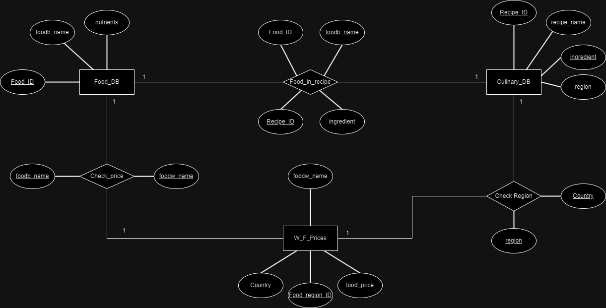

# Modelo para Apresentação do Projeto 1 - Modelo Conceitual e Lógico

## Slides da Apresentação

> Coloque aqui o link para o PDF da apresentação

## Motivação e Contexto
Objetiva-se, por meio deste projeto, realizar uma análise econômica e social no tocante à dietas e alimentos consumidos ao redor do globo, levando em conta os conceitos e ferramentas relacionados à Banco de Dados.
Para isso, utilizamos, principalmente, as bases World Food Prices, CulinaryDB e FooDB, que nos garantem acesso aos custos de ingredientes e receitas da maioria das regiões ao redor do planeta. Desse modo, conseguimos avaliar nutricional e economicamente as múltiplas dietas adotadas mundialmente e associá-las ao seu contexto regional, econômico e social.

## Bases de Dados
| título da base     | link                           | breve descrição             |
| ------------------ | ------------------------------ | --------------------------- |
`World Food Prices` | `https://data.humdata.org/dataset/wfp-food-prices` | `Base de dados que contém informações sobre o preço de alimentos como arroz, feijão, açúcar, entre outros; de mais de 1500 mercados distribuídos por 76 países ao redor do mundo.`
`Culinary DB` | `https://cosylab.iiitd.edu.in/culinarydb/#databasedescription` | `Base de dados que contêm informações sobre ingredientes utilizados e receitas tradicionais de 22 regiões geoculturais do globo.`
`FooDB` | `https://foodb.ca/` | `Base de dados sobre informações químicas e biológicas, como macro e micronutrientes, de centenas de alimentos utilizados no planeta inteiro.`


## Modelo Conceitual

> 

## Modelos Lógicos

```
Food_DB(_Food_ID_, foodb_name, nutrients)
W_F_Prices(_Food_region_ID_, foodw_name, food_price, Country)
Culinary_DB(_Recipe_ID_, _ingredient_, recipe_name, region)
Check_price(_foodb_name_, _foodw_name_)
  foodb_name chave estrangeira -> Food_DB(foodb_name)
  foodw_name chave estrangeira -> W_F_Prices(foodw_name)
Food_in_recipe(_foodb_name_, _Recipe_ID_, Food_ID, ingredient)
  foodb_name, Food_ID chave estrangeira -> Food_DB(foodb_name, Food_ID)
  Recipe_ID, ingredient chave estrangeira -> Culinary_DB(Recipe_ID, ingredient)
Check_region(_Country_, _region_)
  region chave estrangeira -> Culinary_DB(region)
  Country chave estrangeira -> W_F_Prices(Country)
```

## Perguntas de Pesquisa/Análise

> Liste aqui as perguntas de pesquisa/análise. Nem todas as perguntas precisam de implementação associada. É possível haver perguntas em que a solução é apenas descrita para demonstrar o potencial da base. Abaixo são ilustradas três perguntas, mas pode ser um número maior a critério da equipe.

#### Pergunta 1

> - Como relacionar alimentos iguais que possuem id's diferentes em bancos de dados distintos?
>
>   - Para identificar alimentos iguais criaremos um id_universal para cada alimento. Com esse id, seremos capazes de averiguar a base a qual o alimento pertence, bem como relacioná-lo a outras bases.

#### Pergunta 2

> - Como descobrir o preco médio das refeicoes características de uma dada região?  
>
>   - A partir do WF_PRICES, obtemos os preços de alimentos em variadas regiões do mundo. A partir do CulinaryDB, obtemos as receitas características de uma dada região e tambem os ingredientes dessas receitas. Assim, podemos verificar o preço dos ingredientes e, com isso, descobrir o preço da receita. Como temos informações de vários supermercados, podemos, ainda, calcular um preço médio com maior nível de acuidade.

#### Pergunta 3

>  - Qual a relação entre o preço do ingrediente e o seu uso em receitas por região?
>
>   - A partir da base de dados WF_Prices somos capazes de aferir o preço dos alimentos. A partir da base CulinaryDB, associa-se o preço do alimento com o seu uso em receitas típicas, verificando uma relação entre essas duas informações.

### Perguntas/Análise Propostas mas Não Implementadas

#### Pergunta 1

> - Como deduzir o perfil econômico de uma região com o perfil nutricional das refeições típicas?
>
>   - Podemos utilizar a nossa base de dados CulinaryDB, avaliando as receitas de uma região. Com as receitas, seremos capazes de descobrir os ingredientes na base de dados FoodDB, por meio dos quais formaremos um perfil nutricional. Com esse perfil em mão seria possível construir uma análise sobre os reflexos da economia regional sobre a alimentação da população. 

#### Pergunta 2

> - Como a culinária de uma região influencia no seu perfil nutricional?
>  
>   - Analisando a base CulinaryDB, sabemos quais alimentos são mais utilizados nas receitas locais. Além disso, o FoodDB nos fornece os nutrientes de alimentos. Assim, sabemos o perfil nutricional de uma dada região por suas receitas típicas. 

#### Pergunta 3
> - Qual o custo relativo para seguir uma mesma dieta nutricional em países distintos?
>
>   - A partir do FoodDB e do WF_Prices, obtemos os nutrientes e os preços dos alimentos, respectivamente. Combinando essas duas informações, seria possível determinar o custo relativo de consumir os mesmos nutrientes em países distintos.  
